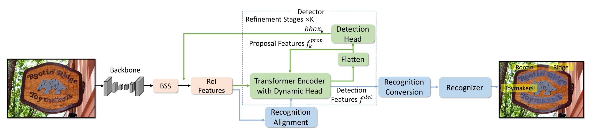

# SwinTextSpotter



This is the pytorch implementation of Paper: SwinTextSpotter v2: Towards Better Synergy for Scene Text Spotting. The paper is available at [this link](https://arxiv.org/pdf/2401.07641).

- We use the models pre-trained on ImageNet. The ImageNet pre-trained [SwinTransformer](https://drive.google.com/file/d/1wvzCMLJtEID8hBDu3wLpPv4xm3Es8ELC/view?usp=sharing) backbone is obtained from [SwinT_detectron2](https://github.com/xiaohu2015/SwinT_detectron2).

## Installation
- Python=3.8
- PyTorch=1.8.0, torchvision=0.9.0, cudatoolkit=11.1
- OpenCV for visualization

## Steps
1. Install the repository (we recommend to use [Anaconda](https://www.anaconda.com/) for installation.)
```
conda create -n SWINTSv2 python=3.8 -y
conda activate SWINTSv2
conda install pytorch==1.8.0 torchvision==0.9.0 torchaudio==0.8.0 cudatoolkit=11.1 -c pytorch -c conda-forge
pip install opencv-python
pip install scipy
pip install shapely
pip install rapidfuzz
pip install timm
pip install Polygon3
git clone https://github.com/mxin262/SwinTextSpotterv2.git
cd SwinTextSpotterv2
python setup.py build develop
```

2. dataset path
```
datasets
|_ totaltext
|  |_ train_images
|  |_ test_images
|  |_ totaltext_train.json
|  |_ weak_voc_new.txt
|  |_ weak_voc_pair_list.txt
|_ mlt2017
|  |_ train_images
|  |_ annotations/icdar_2017_mlt.json
.......
```
Downloaded images
- ICDAR2017-MLT [[image]](https://rrc.cvc.uab.es/?ch=8&com=downloads)
- Syntext-150k: 
  - Part1: 94,723 [[dataset]](https://universityofadelaide.box.com/s/xyqgqx058jlxiymiorw8fsfmxzf1n03p) 
  - Part2: 54,327 [[dataset]](https://universityofadelaide.box.com/s/e0owoic8xacralf4j5slpgu50xfjoirs)
- ICDAR2015 [[image]](https://rrc.cvc.uab.es/?ch=4&com=downloads)
- ICDAR2013 [[image]](https://rrc.cvc.uab.es/?ch=2&com=downloads)
- Total-Text_train_images [[image]](https://drive.google.com/file/d/1idATPS2Uc0PAwTBcT2ndYNLse3yKtT6G/view?usp=sharing)
- Total-Text_test_images [[image]](https://drive.google.com/file/d/1zd_Z5PwiUEEoO1Y0Sb5vQQmG1uNm5v1b/view?usp=sharing)
- ReCTs [[images&label]](https://pan.baidu.com/s/1JC0_rNbsyz564YakptP6Ow) PW: 2b4q
- LSVT [[images&label]](https://pan.baidu.com/s/1j-zlH8SfmdTtH2OnuT9B7Q) PW: 9uh1
- ArT [[images&label]](https://pan.baidu.com/s/165RtrJVIsJ3QqDjesoX1jQ) PW: 2865
- SynChinese130k [[images]](https://drive.google.com/file/d/1w9BFDTfVgZvpLE003zM694E0we4OWmyP/view?usp=sharing)[[label]](https://drive.google.com/file/d/199sLThD_1e0vtDmpWrAEtUJyleS8DDTv/view?usp=sharing)
- Vintext_images [[image]](https://drive.google.com/file/d/1O8t84JtlQZE9ev4dgHrK3TLfbzRu2z9E/view?usp=sharing)

Downloaded label[[Google Drive]](https://drive.google.com/file/d/1Yx3GRRUogjYYDUrprexGnPerFX3H6r_3/view?usp=sharing) [[BaiduYun]](https://pan.baidu.com/s/14N4waNQG2D0UpAJkjc4qQQ) PW: 46vd

Downloader lexicion[[Google Drive]](https://drive.google.com/file/d/1jNX0NQKtyMC1pnh_IV__0drgNwTnupca/view?usp=sharing) and place it to corresponding dataset.

You can also prepare your custom dataset following the example scripts.
[[example scripts]](https://drive.google.com/file/d/1FE17GXyGPhDk5XI3EpbXwlOv1S8txOx2/view?usp=sharing)

## Totaltext
To evaluate on Total Text, CTW1500, ICDAR2015, first download the zipped [annotations](https://1drv.ms/u/c/50d06548d4272c91/EZEsJ9RIZdAggFB6AAAAAAABPi2VUFAMwBxLLPnzDJdquQ?e=HXp7Pa) and unzip it


3. Pretrain SWINTSv2 (e.g., with Swin-Transformer backbone)

```
python projects/SWINTSv2/train_net.py \
  --num-gpus 8 \
  --config-file projects/SWINTSv2/configs/SWINTS-swin-pretrain.yaml
```

4. Fine-tune model on the mixed real dataset

```
python projects/SWINTSv2/train_net.py \
  --num-gpus 8 \
  --config-file projects/SWINTSv2/configs/SWINTS-swin-mixtrain.yaml
```

5. Fine-tune model

```
python projects/SWINTSv2/train_net.py \
  --num-gpus 8 \
  --config-file projects/SWINTSv2/configs/SWINTS-swin-finetune-totaltext.yaml
```

6. Evaluate SWINTSv2 (e.g., with Swin-Transformer backbone)
```
python projects/SWINTSv2/train_net.py \
  --config-file projects/SWINTSv2/configs/SWINTS-swin-finetune-totaltext.yaml \
  --eval-only MODEL.WEIGHTS ./output/model_final.pth
```

7. Visualize the detection and recognition results (e.g., with ResNet50 backbone)
```
python demo/demo.py \
  --config-file projects/SWINTSv2/configs/SWINTS-swin-finetune-totaltext.yaml \
  --input input1.jpg \
  --output ./output \
  --confidence-threshold 0.4 \
  --opts MODEL.WEIGHTS ./output/model_final.pth
```

# Copyright

For commercial purpose usage, please contact Dr. Lianwen Jin: eelwjin@scut.edu.cn

Copyright 2024, Deep Learning and Vision Computing Lab, South China China University of Technology. http://www.dlvc-lab.net
